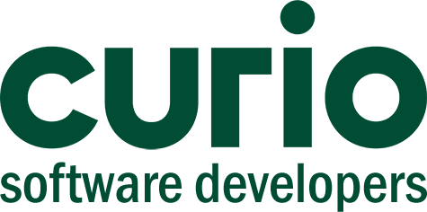

<!-- Project logo -->
 

  

<h3 align="center">Curio - opleiding Software Developer - opendag - website</h3>

  

     
    <a href="https://aarondeklerk.github.io/Curio-SoftwareDeveloper-Opendag-Website/" target="_blank"><strong>Open de website »</strong></a>
  

<!-- Over het project -->

## Over het project

Dit betreft een praktijk opdracht voor school. Het doel van de opdracht was om een website te maken omtrent de opleiding Software Developer op Curio. Dit voor de open dag. Hierbij kregen de bezoekers namelijk een kaartje mee, met een link van een website. Op deze website verschijnt er bij een herlading, steeds een website van een andere student. Op deze manier kunnen de (eventuele) nieuwe studenten zien wat ze onder andere gaan leren en hoe ver wij staan als tweedejaars studenten.

### Tools

- HTML
- CSS
- Javascript

(<a href="#readme-top">Terug naar boven</a>)

<!-- Bijdragen -->

## Bijdragen

Doordat dit een school project was, accepteer ik geen pull requests op deze repository. Wel kun je een fork maken en daarop je eigen versie maken, mocht je dat willen. Als je een fout vind, kun je een issue ervoor aanmaken. 

(<a href="#readme-top">Terug naar boven</a>)

<!-- Contact -->

## Links

Met betrekking tot het project:
- <a href="https://aarondeklerk.github.io/Curio-SoftwareDeveloper-Opendag-Website/" target="_blank">Website (mijn versie) van het project</a>
- <a href="https://github.com/aarondeklerk/Curio-SoftwareDeveloper-Opendag-Website" target="_blank">Github repository van mijn versie van het project</a>
- Voor versies/websites van andere studenten, bekijk de <a href="https://info.curio.codes/" target="_blank">algemene project website</a>

Persoonlijk:
- <a href="https://www.aarondeklerk.nl" target="_blank">Website</a>
- <a href="https://www.aarondeklerk.nl/linktree" target="_blank">Linktree</a>
- <a href="https://www.linkedin.com/in/aaron-de-klerk/" target="_blank">Linkedin</a>
- <a href="https://www.instagram.com/aarondeklerk/" target="_blank">Instagram</a>
- <a href="https://github.com/aarondeklerk/" target="_blank">Github</a>
- <a href="https://www.facebook.com/aaron.deklerk.90/" target="_blank">Facebook</a>

(<a href="#readme-top">Terug naar boven/a>)

<!-- Markdown links & images -->
<!-- https://www.markdownguide.org/basic-syntax/#reference-style-links -->
